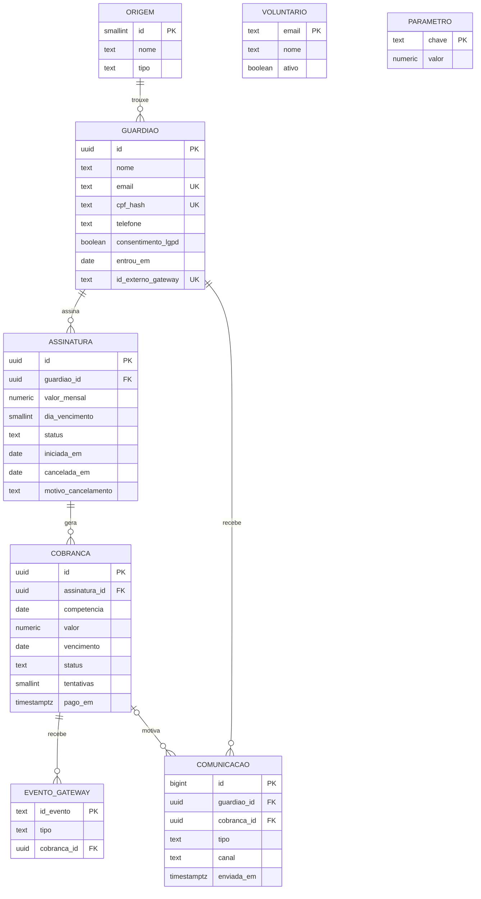

# Modelo de dados adotado

Clube Guardiões do Começo | Instituto Ebenézer | MVP funcional, semana 10

## Princípio

A Asaas, gateway de pagamento já contratado pelo Instituto, é a **fonte da verdade** sobre doadores e pagamentos. Este banco guarda uma **cópia mínima e reconstruível** dessas informações, acrescida do que a Asaas não registra: origem do Guardião, régua de relacionamento e métricas do Clube. Se o banco for perdido, ele é reconstruído pela API da Asaas sem perda de doador ou pagamento.

Dado pessoal mínimo, por LGPD: nome, e-mail, telefone, CPF **cifrado** e o registro do consentimento. Nenhum dado de cartão. O CPF é o identificador único do Guardião, mas o banco só guarda a sua impressão digital com chave secreta (ver [DT-14](decisoes_tecnicas.md) e [LGPD](lgpd_pendencias.md)).

## Diagrama

`VOLUNTARIO` e `PARAMETRO` não se relacionam com as demais: controlam quem opera o painel e os números de negócio.

## Entidades

| Tabela | O que representa | Regras garantidas pelo banco |
|---|---|---|
| `guardiao` | A pessoa que doa | CPF único, guardado só como impressão digital cifrada (`cpf_hash`); e-mail único e em minúsculas; consentimento LGPD obrigatório |
| `assinatura` | O compromisso de doação mensal | No máximo uma ativa por Guardião; valor mínimo de R$ 10; vencimento entre os dias 1 e 28; meio de pagamento `pix` (Asaas) ou `pix_direto` (base atual ainda fora da Asaas, DT-15); cancelamento sempre com data e motivo |
| `cobranca` | A cobrança de cada mês | Uma por assinatura e mês; status `pendente`, `pago`, `falhou`, `recuperado` ou `cancelado`; pagamento sempre com data; recuperada só após ao menos uma falha |
| `comunicacao` | Cada mensagem da régua | Tipos `boas_vindas`, `agradecimento`, `recuperacao`, `impacto_mensal`, `cancelamento`; no máximo uma mensagem de impacto por Guardião por mês |
| `evento_gateway` | Eventos recebidos da Asaas | Um evento só produz efeito uma vez (idempotência do webhook) |
| `origem` | Canal de aquisição | Mede o resultado das 56 horas mensais de aquisição |
| `parametro` | Números de negócio editáveis | Custeio de 2025, metas, taxas e limite de tentativas, alteráveis sem mexer em código |
| `voluntario` | Quem pode operar o painel | Só e-mails desta tabela, com login, veem dados e executam o fluxo |
| `privado.segredo` | Chave secreta do CPF | Gerada na instalação; esquema sem acesso pela API |

## Correspondência com a Asaas

| Aqui | Na Asaas | Campo de ligação |
|---|---|---|
| `guardiao` | Cliente (`customer`) | `id_externo_gateway` (cus_...) |
| `assinatura` | Assinatura (`subscription`) | `id_externo_gateway` (sub_...) |
| `cobranca` | Cobrança (`payment`) | `id_externo_gateway` (pay_...) |
| `evento_gateway` | Evento de webhook | `id_evento` |

Os eventos tratados têm os nomes usados pela Asaas: `PAYMENT_RECEIVED` (pagamento recebido) e `PAYMENT_OVERDUE` (cobrança vencida).

## Métricas (views)

| View | Mostra | Liga ao business case |
|---|---|---|
| `vw_situacao_guardiao` | Cada Guardião como `ativo`, `em_risco` ou `cancelado` | Base de Guardiões |
| `vw_alerta_churn` | Guardiões ativos com cobrança falhada, por prioridade | Churn, a variável que mais move o resultado |
| `vw_metricas_mensais` | Ativos, novos, cancelados, receita, ticket médio e churn por mês | Slides 8 e 9 |
| `vw_painel_resumo` | Último mês fechado e cobertura do custeio de 2025 | Indicador principal do projeto |
| `vw_cobrancas_mes` | Cobranças de cada mês com o nome do Guardião | Rotina mensal e prestação de contas |
| `vw_origem_resultado` | Guardiões, retenção e receita por canal de aquisição | Retorno das 56 h mensais de aquisição |

## Funções do fluxo

| Função | Papel | Quem chama |
|---|---|---|
| `fn_aderir_publico` | Adesão pela página pública ou pelo voluntário, com CPF | Visitante e voluntário |
| `fn_consultar_cpf` | Responde se um CPF já é Guardião, sem revelar o número | Voluntário |
| `fn_cpf_valido`, `fn_cpf_hash` | Validam o CPF e calculam a impressão digital | Somente dentro do banco |
| `fn_gerar_cobrancas` | Cobrança do mês (só no MVP; em produção, a Asaas cria) | Voluntário |
| `fn_processar_evento` | Pix pago ou vencido, com idempotência | Webhook da Asaas (produção) ou simulador (MVP) |
| `fn_simular_gateway` | Simula os avisos da Asaas para o mês inteiro | Voluntário, só na demonstração |
| `fn_cadastrar_pix_direto` | Cadastra um Guardião da base atual em Pix direto, com CPF e consentimento | Voluntário |
| `fn_registrar_pix_direto` | Registra o Pix direto conferido no extrato (recebido ou não), pelo mesmo caminho do webhook | Voluntário |
| `fn_migrar_para_asaas` | Passa a assinatura de Pix direto para a Asaas, mantendo valor, dia e histórico | Voluntário |
| `fn_enviar_impacto_mensal` | Notícia mensal de impacto, uma vez por mês | Voluntário |
| `fn_cancelar` | Cancelamento a pedido ou por inadimplência | Voluntário e `fn_processar_evento` |
| `fn_gerar_dados_sinteticos` | Gera a base de demonstração | Somente pelo SQL Editor |

## Arquivos

| Arquivo | Conteúdo |
|---|---|
| `db/01_schema.sql` | Tabelas, restrições e índices |
| `db/02_funcoes.sql` | Fluxo principal, controle de acesso, adesão pública e simulador |
| `db/03_views.sql` | Métricas do painel |
| `db/04_dados_referencia.sql` | Parâmetros e canais reais (carregar também em produção) |
| `db/05_dados_sinteticos.sql` | Gerador de dados sintéticos (somente demonstração) |
| `db/06_supabase_seguranca.sql` | Regras de acesso |
