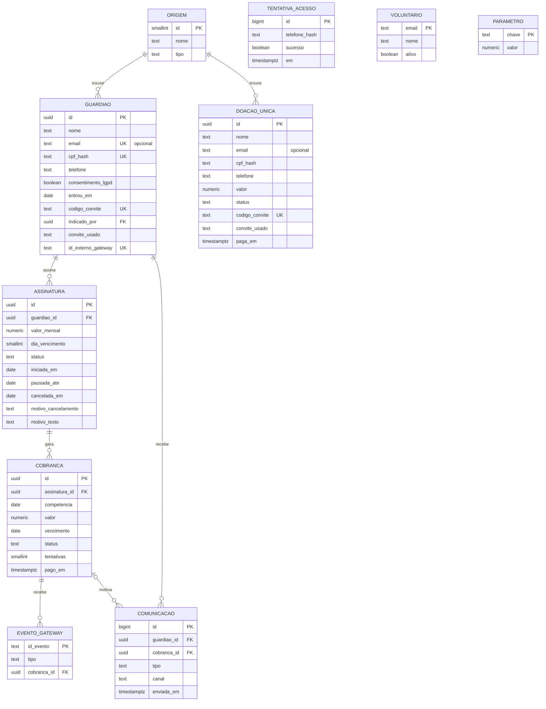

# Modelo de dados adotado

Clube Guardiões do Futuro | Instituto Ebenézer | MVP funcional, semana 10

## Princípio

A Asaas, gateway de pagamento já contratado pelo Instituto, é a **fonte da verdade** sobre doadores e pagamentos. Este banco guarda uma **cópia mínima e reconstruível** dessas informações, acrescida do que a Asaas não registra: origem do Guardião, régua de relacionamento e métricas do Clube. Se o banco for perdido, ele é reconstruído pela API da Asaas sem perda de doador ou pagamento.

Dado pessoal mínimo, por LGPD: nome, telefone, e-mail (opcional), CPF **cifrado** e o registro do consentimento. Nenhum dado de cartão. O CPF é o identificador único do Guardião, mas o banco só guarda a sua impressão digital com chave secreta (ver [DT-14](decisoes_tecnicas.md) e [LGPD](lgpd_pendencias.md)).

## Desenho oficial do banco (entrega)

Lido do catálogo do Supabase (PostgreSQL 17.6, migração 32):

- [`docs/diagramas/diagrama_banco_de_dados.pdf`](diagramas/diagrama_banco_de_dados.pdf): 3 páginas A3. (1) Diagrama entidade-relacionamento físico, notação pé de galinha, com as 13 tabelas, todas as colunas, tipos, chaves, relações e regras; (2) camadas de acesso: papéis, 34 funções, 7 views e matriz de permissões por tabela; (3) dicionário de dados de cada coluna, índices, regras CHECK e valores permitidos.
- [`docs/diagramas/diagrama_banco_de_dados_erd.png`](diagramas/diagrama_banco_de_dados_erd.png): a página 1 em imagem.
- [`docs/diagramas/diagrama_banco_de_dados.dbml`](diagramas/diagrama_banco_de_dados.dbml): o mesmo modelo em DBML, formato aberto que pode ser importado em ferramentas como o dbdiagram.io para editar o diagrama.

## Diagrama resumido

`VOLUNTARIO` e `PARAMETRO` não se relacionam com as demais: controlam quem opera o painel e os números de negócio. `DOACAO_UNICA` liga-se ao Guardião só pelo CPF cifrado (o recibo anual soma as duas) e pelos códigos de convite; `TENTATIVA_ACESSO` registra as entradas na Minha Área para o bloqueio por tentativas.

## Entidades

| Tabela | O que representa | Regras garantidas pelo banco |
|---|---|---|
| `guardiao` | A pessoa que doa todo mês | CPF único, guardado só como impressão digital cifrada (`cpf_hash`); e-mail opcional, único e em minúsculas; consentimento LGPD obrigatório; código de convite único (`codigo_convite`), quem convidou (`indicado_por`, nunca a si mesmo) e o código do link usado (`convite_usado`, de um Guardião ou de uma doação única) |
| `assinatura` | O compromisso de doação mensal | No máximo uma ativa por Guardião; valor mínimo de R$ 10 no banco (novas adesões e reativações entram com o parâmetro `valor_guardiao`, R$ 85; a base antiga mantém o valor que já doa); vencimento entre os dias 1 e 28; meio de pagamento `pix` (Asaas) ou `pix_direto` (base atual ainda fora da Asaas, DT-15); status `ativa`, `pausada` ou `cancelada`; pausada sempre com `pausada_ate` (primeiro dia do mês de volta); cancelamento sempre com data e motivo, e `motivo_texto` opcional de até 200 caracteres dito pelo Guardião |
| `cobranca` | A cobrança de cada mês | Uma por assinatura e mês; status `pendente`, `pago`, `falhou`, `recuperado` ou `cancelado`; pagamento sempre com data; recuperada só após ao menos uma falha |
| `comunicacao` | Cada mensagem da régua e cada contato da equipe | Tipos `boas_vindas`, `agradecimento`, `recuperacao`, `impacto_mensal`, `cancelamento`, `contato_pessoal`, `pausa`, `retomada`, `reativacao`; no máximo uma mensagem de impacto por Guardião por mês; `conteudo` guarda o texto da notícia ou a anotação do contato |
| `atividade` | Atividades da rotina das crianças que a doação sustenta | Contraturno Escolar, Laboratório de Sonhos e Vivências Terapêuticas (as da semana 5) |
| `impacto_mensal` | O que cada atividade sustentou no mês | Um texto por atividade e mês, de 10 a 600 caracteres; a notícia de impacto só sai com ele registrado |
| `doacao_unica` | Doação avulsa de qualquer valor, de Guardião ou não (DT-17) | Valor de R$ 10 a R$ 50.000; CPF só cifrado; e-mail opcional e em minúsculas; consentimento LGPD obrigatório; status `pendente`, `paga` ou `falhou`, paga sempre com data; código de convite único e `convite_usado` |
| `tentativa_acesso` | Cada tentativa de entrar na Minha Área (DT-18) | Telefone guardado só como impressão digital (HMAC com a chave do CPF); cinco erros em 15 minutos bloqueiam o mesmo WhatsApp |
| `evento_gateway` | Eventos recebidos da Asaas | Um evento só produz efeito uma vez (idempotência do webhook) |
| `origem` | Canal de aquisição | Mede o resultado das horas mensais de captação (56 h nas Fases 1 e 2, 72 h na Fase 3) |
| `parametro` | Números de negócio editáveis | Custeio de 2025, metas, taxas, limite de tentativas, valor do Guardião (`valor_guardiao` = 85), pausa máxima (`pausa_maxima_meses` = 3), meses por estrela (`meses_por_estrela` = 3) e `modo_demonstracao` (1 na demonstração, 0 em produção), alteráveis sem mexer em código |
| `voluntario` | Quem pode operar o painel | Só e-mails desta tabela, com login, veem dados e executam o fluxo |
| `privado.segredo` | Chave secreta do CPF | Gerada na instalação; esquema sem acesso pela API |

## Correspondência com a Asaas

| Aqui | Na Asaas | Campo de ligação |
|---|---|---|
| `guardiao` | Cliente (`customer`) | `id_externo_gateway` (cus_...) |
| `assinatura` | Assinatura (`subscription`) | `id_externo_gateway` (sub_...) |
| `cobranca` | Cobrança (`payment`) | `id_externo_gateway` (pay_...) |
| `doacao_unica` | Cobrança avulsa (`payment`, sem assinatura) | `id_externo_gateway` (pay_...) |
| `evento_gateway` | Evento de webhook | `id_evento` |

Os eventos tratados têm os nomes usados pela Asaas: `PAYMENT_RECEIVED` (pagamento recebido) e `PAYMENT_OVERDUE` (cobrança vencida).

## Métricas (views)

| View | Mostra | Liga ao business case |
|---|---|---|
| `vw_situacao_guardiao` | Cada Guardião como `ativo`, `em_risco`, `pausado` (com `pausada_ate`) ou `cancelado`, com o meio de pagamento, meses pagos, estrelas, nível (`fn_nivel`) e indicações somadas das duas tabelas (Guardiões e doações únicas) | Base de Guardiões |
| `vw_alerta_churn` | Guardiões ativos com cobrança falhada, por prioridade, com o último contato da equipe | Churn, a variável que mais move o resultado |
| `vw_metricas_mensais` | Ativos, novos, cancelados, receita, ticket médio e churn por mês | Slides 8 e 9 |
| `vw_painel_resumo` | Último mês fechado, Guardiões no Clube (ativos e pausados), Guardiões pausados, doações únicas do mês (quantidade e valor) e cobertura do custeio de 2025 | Indicador principal do projeto |
| `vw_cobrancas_mes` | Cobranças de cada mês com o nome do Guardião | Rotina mensal e prestação de contas |
| `vw_origem_resultado` | Guardiões, retenção e receita por canal de aquisição | Retorno das horas mensais de captação |
| `vw_doacoes_unicas` | Doações únicas com valor, status, canal, quem convidou e indicações geradas, sem o CPF cifrado | Receita pontual, fora das métricas de recorrência |

## Funções do fluxo

| Função | Papel | Quem chama |
|---|---|---|
| `fn_aderir_publico` | Adesão pela página pública ou pelo voluntário, com CPF, e-mail opcional e código de convite opcional; aceita só o valor do Guardião (R$ 85); devolve só os dados das telas de Pix e confirmação | Visitante e voluntário |
| `fn_doar_unica` | Doação única de R$ 10 a R$ 50.000, com CPF, e-mail opcional e código de convite opcional | Visitante e voluntário |
| `fn_confirmar_doacao_demo` | "Já paguei" da doação única; só funciona com `modo_demonstracao = 1` | Visitante, só na demonstração |
| `fn_processar_doacao_unica` | Pix da doação única pago ou vencido, pelo caminho do webhook | Webhook da Asaas (produção) ou voluntário |
| `fn_convite_nome`, `fn_convite_valido` | Primeiro nome de quem convidou, a partir do código do link; vale para Guardião ativo ou pausado e para doação única paga | Visitante (só `fn_convite_nome`) |
| `fn_area` | Entrada na Minha Área com WhatsApp e CPF; devolve primeiro nome, status, nível, estrelas, impacto, histórico e indicações, nunca e-mail, telefone ou CPF; bloqueia após 5 erros em 15 minutos (`fn_area_autenticar`, `fn_area_dados`) | Visitante |
| `fn_area_acao` | Ações do próprio Guardião: pausar, retomar, cancelar com motivo, reativar por R$ 85 e, só na demonstração, regularizar o Pix em atraso | Visitante, conferindo WhatsApp e CPF a cada chamada |
| `fn_area_recibo` | Recibo anual das doações pagas (mensais e únicas do mesmo CPF), só para o próprio Guardião | Visitante, conferindo WhatsApp e CPF |
| `fn_pausar`, `fn_retomar` | Pausa de 1 a 3 meses e retomada, a pedido do Guardião (`fn_pausar_interno`, `fn_retomar_interno`) | Voluntário |
| `fn_nivel` | Nível pelo número de estrelas: 3 Bronze, 4 Prata, 5 ou mais Ouro | Views e voluntário |
| `fn_salvar_impacto` | Registra o que uma atividade sustentou no mês | Voluntário |
| `fn_registrar_contato` | Registra o contato pessoal da equipe com um Guardião | Voluntário |
| `fn_consultar_cpf` | Responde se um CPF já é Guardião, sem revelar o número | Voluntário |
| `fn_cpf_valido`, `fn_cpf_hash` | Validam o CPF e calculam a impressão digital | Somente dentro do banco |
| `fn_gerar_cobrancas` | Cobrança do mês (só no MVP; em produção, a Asaas cria); antes, reativa as assinaturas cuja pausa termina no mês e registra a `retomada` | Voluntário |
| `fn_processar_evento` | Pix pago ou vencido, com idempotência | Webhook da Asaas (produção) ou simulador (MVP) |
| `fn_simular_gateway` | Simula os avisos da Asaas para o mês inteiro | Voluntário, só na demonstração |
| `fn_cadastrar_pix_direto` | Cadastra um Guardião da base atual em Pix direto, com CPF e consentimento | Voluntário |
| `fn_registrar_pix_direto` | Registra o Pix direto conferido no extrato (recebido ou não), pelo mesmo caminho do webhook | Voluntário |
| `fn_migrar_para_asaas` | Passa a assinatura de Pix direto para a Asaas, mantendo valor, dia e histórico | Voluntário |
| `fn_enviar_impacto_mensal` | Notícia mensal de impacto, uma vez por mês, com o texto de cada atividade | Voluntário |
| `fn_cancelar` | Cancelamento a pedido ou por inadimplência | Voluntário e `fn_processar_evento` |
| `fn_gerar_dados_sinteticos` | Gera a base de demonstração | Somente pelo SQL Editor |

## Arquivos

| Arquivo | Conteúdo |
|---|---|
| `db/01_schema.sql` | Tabelas, restrições e índices |
| `db/02_funcoes.sql` | Fluxo principal, controle de acesso, adesão pública e simulador |
| `db/03_views.sql` | Métricas do painel |
| `db/04_dados_referencia.sql` | Parâmetros e canais reais (carregar também em produção) |
| `db/05_dados_sinteticos.sql` | Gerador de dados sintéticos (somente demonstração) |
| `db/06_supabase_seguranca.sql` | Regras de acesso |
